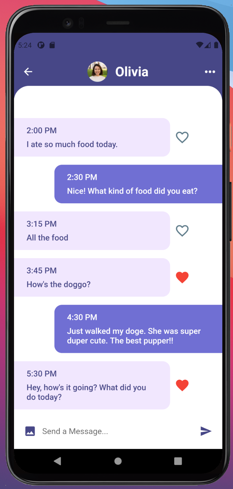

# Chaty: Fullstack Cross-Platform Chat Application

**A full-stack, cross-platform, cloud-based, iOS/Android chat application leveraging Firebase's real-time database, cloud storage, and authentication services, built with Flutter.**

Chaty is a powerful cross-platform messaging application designed with scalability and real-time performance in mind. This project showcases the integration of Firebase's comprehensive BaaS (Backend as a Service) solution with Flutter’s versatile UI framework, adhering to modern mobile development best practices.

---

## Key Features

- **Real-Time Communication**: Leverages Firebase Firestore to provide real-time messaging capabilities, with optimized data syncing across devices.
- **Reactions and Message Interactions**: Users can like/unlike messages, with instant updates across all connected clients.
- **Cross-Platform Compatibility**: Developed using Flutter to ensure smooth and consistent experiences on both iOS and Android devices.
- **Firebase Authentication**: Secure authentication with email/password login, as well as social login options (Google, Facebook, etc.).
- **Cloud Firestore**: Highly scalable, NoSQL database to manage conversations and store message data in real-time.
- **Push Notifications**: Integrated with Firebase Cloud Messaging (FCM) for real-time alerts and notifications, even when the app is running in the background.

---

## Project Architecture

This app follows the **MVVM (Model-View-ViewModel)** architecture pattern to ensure a clear separation of concerns, making the app more maintainable and scalable over time.

- **State Management**: Uses **Provider** package for efficient state management and data flow.
- **Responsive UI**: Ensures adaptive layouts for various screen sizes using Flutter’s `MediaQuery` and `LayoutBuilder` for a seamless experience on different devices.
- **Error Handling**: Implements robust error handling techniques, with appropriate feedback provided to users during network failures or authentication issues.
- **Security**: Follows Firebase's security rules and uses HTTPS for secure communication.

---

## Screenshots

### Modern User Interface


### Interactive Messaging with Reactions



---

## Tech. Stack

- **Frontend**:
  - **Flutter**: Dart-based UI toolkit for building natively compiled applications for mobile from a single codebase.
  - **Dart**: Chosen for its fast performance and seamless integration with Flutter's widget system.
- **Backend**:
  - **Firebase Authentication**: Provides secure, out-of-the-box user authentication via email, Google, and Facebook.
  - **Cloud Firestore**: NoSQL cloud database used for storing chat data in real-time.
  - **Firebase Cloud Messaging (FCM)**: Integrated to send real-time push notifications across all devices.
- **State Management**:

  - **Provider**: A Flutter package used for managing app-wide state in an efficient and scalable manner.

- **Continuous Integration/Deployment (CI/CD)**:
  - Configured using **GitHub Actions** to automatically build and test the app with every pull request.

---

## Installation & Setup

1. **Clone the repository**:

   ```bash
   git clone https://github.com/wasiqnauman/chaty.git
   ```

2. **Install dependencies**:

   ```bash
   flutter pub get
   ```

3. **Firebase Configuration**:

   - Create a Firebase project at [Firebase Console](https://console.firebase.google.com/).
   - Enable **Firestore**, **Authentication**, and **Cloud Messaging**.
   - Download the `google-services.json` for Android and `GoogleService-Info.plist` for iOS, and place them in the respective directories.

4. **Run the app**:
   ```bash
   flutter run
   ```

---

## Future Plans for additional features

- **End-to-End Encryption**: Implement end-to-end encryption for secure messaging between users.
- **Media Sharing**: Extend functionality to allow sharing of images, videos, and files within chats.
- **Group Chats**: Add support for group conversations with additional admin functionalities.
- **Voice and Video Calls**: Integrate WebRTC for real-time voice and video calling features.

---
